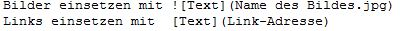

# Workflow
1. Git Gui öffnen und neuen Repository erzeugen
1. Notepad++ öffnen und Datei unter .md Datentyp im Repository speichern
1. Text eingeben
1. Mit Git Dokument nach Änderungen durchscannen (Rescan), Änderungen hinzufügen (Stage changed), dokumentieren (Sign Off), das Ganze bestätigen (Commit)
1. Weitere Änderungen nach diesem Schema durchführen
1. Bilder einsetzen mit 
1. Links einsetzen mit  [Text](https://github.com/JoscheF/Workflow)
1. Im Gui-Hub Server ein neues Projekt erstellen 
1. Das Projekt mit dem angezeigten Link auf den Server laden (Push)
